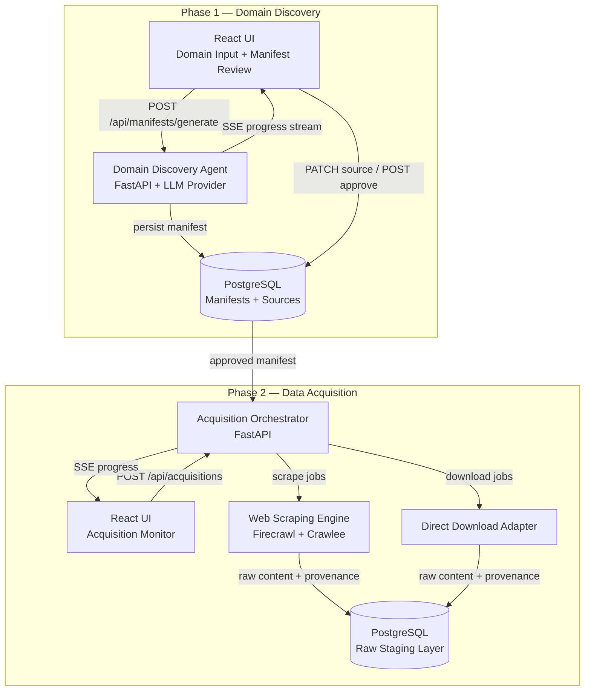

# RARIS — Architecture

## Overview

RARIS is a full-stack pipeline: AI agents discover regulatory domains → produce manifests
→ drive data acquisition → ingestion → retrieval. LLM provider is swappable at runtime
via `LLM_PROVIDER` env var.

**Dev environment:** Hybrid — Docker Compose for infrastructure (PostgreSQL, Redis),
backend and frontend run natively for fast iteration.

## Data Flow



## Tech Stack

| Component | Technology | Rationale |
|-----------|-----------|-----------|
| **Backend** | Python 3.12 + FastAPI | Async-native, excellent LLM library ecosystem, type hints |
| **Frontend** | React 18 + TypeScript + Vite | Component model for complex review UIs, type safety, fast HMR |
| **Database** | PostgreSQL 16 | JSONB for flexible manifest storage, full-text search, proven reliability |
| **Job Queue** | Redis 7 | Lightweight pub/sub and job queue for acquisition orchestration |
| **LLM** | Configurable (`openai` \| `anthropic` \| `gemini`) | Provider flexibility, cost optimization, capability comparison |
| **Web Scraping** | Firecrawl + Crawlee | Firecrawl for JS-rendered pages, Crawlee for static multi-page crawls |
| **Infrastructure** | Docker Compose | PostgreSQL + Redis containers; backend/frontend run natively |
| **CI/CD** | GitHub Actions | PR gate (lint + test + build), branch protection |

## Service Boundaries

### `backend` (FastAPI — port 8000)
- Owns all business logic: agent orchestration, manifest CRUD, acquisition management
- Exposes REST API + SSE streams for frontend consumption
- Manages LLM provider selection and invocation
- Writes to and reads from PostgreSQL

### `frontend` (Vite dev server — port 5173)
- React SPA consuming the backend API
- Phase 1: Manifest Review Dashboard (domain input, agent progress, source review)
- Phase 2: Acquisition Monitor (run status, source progress, error logs)
- No direct database access — all data flows through the backend API

### `db` (PostgreSQL 16 — port 5432)
- Stores manifests, sources, domain maps, coverage assessments
- Stores acquisition runs, staged documents, provenance metadata
- Schema managed via Alembic migrations

### `redis` (Redis 7 — port 6379)
- Job queue for Phase 2 acquisition orchestration
- Tracks per-source job state: pending, running, complete, failed, retrying
- Pub/sub for SSE progress event distribution

## LLM Provider Abstraction Layer

The LLM provider is selected at runtime via the `LLM_PROVIDER` environment variable.
All agent logic uses the abstract interface — no provider-specific code in business logic.

```python
from abc import ABC, abstractmethod
from typing import AsyncIterator

class LLMProvider(ABC):
    @abstractmethod
    async def complete(self, messages: list[dict], **kwargs) -> str:
        """Send messages and return a complete response."""
        ...

    @abstractmethod
    async def stream(self, messages: list[dict], **kwargs) -> AsyncIterator[str]:
        """Send messages and stream response tokens."""
        ...

class OpenAIProvider(LLMProvider): ...
class AnthropicProvider(LLMProvider): ...
class GeminiProvider(LLMProvider): ...

# Provider registry — selected by LLM_PROVIDER env var
providers: dict[str, type[LLMProvider]] = {
    "openai": OpenAIProvider,
    "anthropic": AnthropicProvider,
    "gemini": GeminiProvider,
}
```

## Data Flow Narrative

1. **Domain Input** — User describes a regulatory domain in natural language via the React UI
2. **Agent Execution** — The Domain Discovery Agent (FastAPI) invokes the configured LLM provider
   to map the regulatory landscape, discover sources, map relationships, and assess coverage
3. **Manifest Generation** — Agent produces a structured YAML manifest and persists it to PostgreSQL
4. **Human Review** — User reviews the manifest in the React UI, edits sources, approves or rejects
5. **Acquisition** — Approved manifest is consumed by the Acquisition Orchestrator, which routes
   each source to the appropriate adapter (scrape, download, API, manual) via Redis job queue
6. **Staging** — Acquired content is stored in the Raw Staging Layer with full provenance metadata

## Dev Environment (Hybrid)

**Docker Compose** — infrastructure only:
```yaml
services:
  db:
    image: postgres:16
    ports: ["5432:5432"]
    volumes: [pgdata:/var/lib/postgresql/data]
    environment:
      POSTGRES_DB: raris
      POSTGRES_USER: raris
      POSTGRES_PASSWORD: ${POSTGRES_PASSWORD}
  redis:
    image: redis:7
    ports: ["6379:6379"]
volumes:
  pgdata:
```

**Native services:**
- Backend: `uv run uvicorn backend.app.main:app --reload --port 8000`
- Frontend: `cd frontend && npm run dev` (Vite on port 5173)

## GitHub Actions Pipeline

### PR Gate (runs on every PR to `main`)

| Job | Tool | What It Checks |
|-----|------|----------------|
| `lint` | ruff (Python) + eslint (TypeScript) | Code style, import ordering, type errors |
| `test-backend` | pytest | Backend unit and integration tests |
| `test-frontend` | vitest | Frontend component and unit tests |
| `build` | docker compose build | All services build without errors |

All four jobs must pass before a PR can be merged. Branch protection requires passing CI
and at least 1 approving review.
