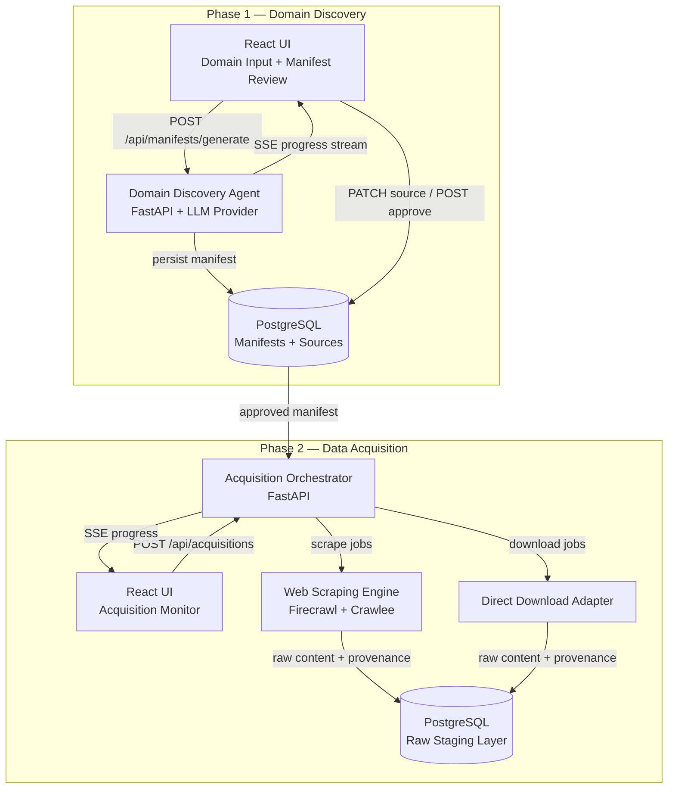

# Handoff — Write Formal Plan Documents

**Project:** RARIS
**PID:** PID-RA7X1
**Persona:** Lolita
**Directory:** X:\RARIS

---

## MANDATORY READS BEFORE DOING ANYTHING

1. `CLAUDE.md` — already auto-loaded from project root
2. `docs/DFW-CONSTITUTION.md`
3. `docs/DFW-OPERATING-MANUAL.md`
4. `.dfw/personal-config.md`
5. `context/_ACTIVE_CONTEXT.md`
6. `RARI_MACRO_DEVELOPMENT_PLAN_v2.0.md` — the source of truth for all phase definitions

After reading, display the DFW constitution status card (Section 6B, Step 4 of the constitution).

---

## CONTEXT

RARIS (Research and Analysis of Regulatory Information System) is an AI-agent-driven
platform that maps regulatory domains, discovers source documents, and produces structured
YAML manifests that drive automated web scraping and ingestion pipelines.

The DFW scaffold is complete (PID-RA7X1, committed to GitHub). The next step is to write
all formal planning and specification documents before any implementation begins.

**First test domain:** All US Insurance regulation — federal + all 50 states, all lines
(health, property/casualty, life, surplus lines).

**Tech stack (locked):**
- Backend: Python 3.12 + FastAPI
- Frontend: React 18 + TypeScript + Vite
- Database: PostgreSQL
- LLM: Configurable via `LLM_PROVIDER` env var (`openai` | `anthropic` | `gemini`)
- Web Scraping: Firecrawl + Crawlee hybrid (Phase 2)
- Dev environment: Docker Compose
- CI/CD: GitHub Actions

**Testability constraint:** Every phase ships a React UI so the output is verifiable
without touching the terminal.

---

## YOUR TASK

Write all planning and specification documents listed below. Follow DFW conventions
exactly (sequencing, YAML frontmatter, DFW tags). After all documents are written,
commit and push to GitHub.

Use `.dfw/session-state.json` to track progress. Update it after each completed document
so the session can be resumed if interrupted.

---

## DOCUMENTS TO WRITE (execute in this order)

### 1. `docs/PROJECT_OVERVIEW.md` (OVERWRITE existing stub)

Content:
- RARIS mission: AI-driven regulatory domain mapping, manifest generation, and
  automated content acquisition for compliance and research use cases
- Problem statement: Regulatory research is manual, fragmented, and slow. RARIS
  automates domain mapping and source discovery, producing structured manifests
  that drive scraping pipelines
- Scope: All US Insurance regulation (Phase 1). Additional verticals (mortgage,
  medical/gig, others) in Phase 5
- Architecture overview (1-paragraph summary, link to ARCHITECTURE.md)
- Phase summary table (Phase 0-6, one-line description each, status column)
- Success metrics:
  - Manifest accuracy: ≥95% of regulatory bodies and key sources identified per domain
  - Scrape completion rate: ≥90% of manifest sources successfully acquired
  - Retrieval precision/recall: defined per Phase 4 evaluation framework
  - Time to domain manifest: target <4 hours agent runtime per domain
- Links: ARCHITECTURE.md, _ROADMAP.md, all phase spec docs

---

### 2. `docs/ARCHITECTURE.md` (OVERWRITE existing stub)

Content:
- Full-stack architecture with mermaid diagram (see data flow below)
- Tech stack table with rationale for each choice
- Service boundaries: what each service owns
- LLM provider abstraction layer design:
  - `LLMProvider` abstract base class
  - Concrete implementations: `OpenAIProvider`, `AnthropicProvider`, `GeminiProvider`
  - Selected via `LLM_PROVIDER` env var at runtime
- Data flow narrative: domain input → agent → manifest → acquisition → staging
- Docker Compose service map: `backend`, `frontend`, `db` (postgres), `redis` (job queue)
- GitHub Actions pipeline overview: PR gate (lint + test + build) + main branch deploy

Mermaid data flow diagram to include:



---

### 3. `plans/_ROADMAP.md` (OVERWRITE existing stub)

Content: Phase 0-6 roadmap. For each phase include:
- Phase number and name
- One-line goal
- React UI deliverable (what the UI lets you test/verify)
- Key exit criteria (3-5 bullet points from the macro plan)
- Status: `#status/backlog` for all except Phase 0 which is `#status/active`

Source of truth for phase content: `RARI_MACRO_DEVELOPMENT_PLAN_v2.0.md`

---

### 4. `docs/001-spec-phase0-foundation.md`

YAML frontmatter:
```yaml
type: spec
created: 2026-02-25
sessionId: S20260225_0002
source: cursor
description: Phase 0 — Project Foundation spec (Docker, CI/CD, evaluation framework)
tags: [raris, phase0, spec, "#status/active", "#priority/critical"]
```

Content:
- **Docker Compose spec:** services — `backend` (FastAPI, port 8000),
  `frontend` (Vite dev server, port 5173), `db` (postgres:16, port 5432),
  `redis` (redis:7, port 6379 — job queue for Phase 2). Volume mounts,
  env file references, health checks.
- **GitHub Actions CI pipeline:**
  - Trigger: every PR to `main`
  - Jobs: `lint` (ruff + eslint), `test-backend` (pytest), `test-frontend` (vitest),
    `build` (docker compose build). All must pass before merge.
  - Branch protection: require passing CI + 1 review
- **Evaluation framework skeleton:**
  - Metrics defined: manifest accuracy, source recall, scrape completion rate,
    ingestion success rate, retrieval precision@k, retrieval recall@k
  - Test harness: pytest fixtures for manifest validation, benchmark dataset
    definitions (ground truth insurance sources list)
  - Scoring: each metric has a defined passing threshold
- **Branch convention:** `phase{N}/{component-name}` (e.g., `phase1/domain-discovery-agent`)
- **Contributing guide:** commit message format, PR description template
- **Exit criteria:**
  - [ ] `docker compose up` starts all 4 services with no errors
  - [ ] CI pipeline runs on every PR and blocks merge on failure
  - [ ] Evaluation framework has passing metric definitions and test harness skeleton
  - [ ] Phase 1 spec reviewed and approved

---

### 5. `docs/002-spec-phase1-domain-discovery.md`

YAML frontmatter:
```yaml
type: spec
created: 2026-02-25
sessionId: S20260225_0002
source: cursor
description: Phase 1 — Domain Discovery Agent, YAML manifest schema, React review UI
tags: [raris, phase1, spec, "#status/backlog", "#priority/critical"]
```

Content sections:

**A. Domain Discovery Agent Architecture**
Five sub-components in sequence:
1. Landscape Mapper — identifies regulatory bodies, authority hierarchy, jurisdiction levels
2. Source Hunter — finds URLs, doc types, formats, access methods per regulatory body
3. Relationship Mapper — maps cross-references, supersession chains, applicability
4. Coverage Assessor — completeness evaluation, gap identification, confidence scoring
5. Manifest Generator — produces validated YAML, flags items needing human review

Tools available to agent: web search, web fetch, LLM reasoning, schema validator.
The agent DISCOVERS — it does NOT scrape. Scraping is Phase 2.

**B. LLM Provider Abstraction**
```python
class LLMProvider(ABC):
    async def complete(self, messages: list[dict], **kwargs) -> str: ...
    async def stream(self, messages: list[dict], **kwargs) -> AsyncIterator[str]: ...

# Selected by LLM_PROVIDER env var
providers = {
    "openai": OpenAIProvider,
    "anthropic": AnthropicProvider,
    "gemini": GeminiProvider,
}
```

**C. Full YAML Manifest Schema**
Copy the complete schema from `RARI_MACRO_DEVELOPMENT_PLAN_v2.0.md` verbatim.
Add schema validation rules (required fields, value enumerations).

**D. FastAPI Endpoint Specifications**

| Method | Path | Description |
|--------|------|-------------|
| POST | `/api/manifests/generate` | Start agent run for a domain description |
| GET | `/api/manifests/{id}` | Get manifest with all sources |
| GET | `/api/manifests/{id}/stream` | SSE stream of agent progress events |
| GET | `/api/manifests` | List all manifests |
| PATCH | `/api/manifests/{id}/sources/{src_id}` | Edit a source entry |
| POST | `/api/manifests/{id}/sources` | Add a source manually |
| POST | `/api/manifests/{id}/approve` | Approve manifest → status: approved |
| POST | `/api/manifests/{id}/reject` | Reject manifest with notes |

Request/response schemas for each endpoint.

**E. React UI — Manifest Review Dashboard**

Components:
1. **Domain Input Panel** — text area for domain description, "Generate Manifest" button,
   model selector (openai / anthropic / gemini)
2. **Agent Progress Panel** — SSE-connected live log of agent steps, progress bar
   (landscape → sources → relationships → coverage → manifest)
3. **Manifest Summary Card** — domain name, total sources, coverage score, status badge
4. **Sources Table** — columns: ID, name, regulatory body, type, format, authority,
   jurisdiction, confidence score, needs_review flag. Row actions: edit, approve, reject.
   Filter by: jurisdiction, type, needs_review. Sort by confidence.
5. **Coverage Summary** — breakdown by jurisdiction (federal/state/municipal),
   by type (statute/regulation/guidance/standard/educational), known gaps list
6. **Approve / Request Revision buttons** — gated: disabled until all flagged
   sources are reviewed

**F. Insurance Domain First Run Plan**
Federal bodies: CMS, HHS (ACA), DOL (ERISA), FIO (Treasury), CFPB, SEC (variable annuities)
National bodies: NAIC (model laws, IRIS, FAST), NCOIL, IAIS
State regulators: All 50 state insurance commissioner offices
Lines covered: Health, Property & Casualty, Life & Annuities, Surplus Lines, Title
Estimated source count: 200-400 entries

**G. Acceptance Criteria**
- Agent accepts a plain-language domain description and produces a valid YAML manifest
- Manifest schema validator passes on all agent-produced manifests
- React UI allows full review workflow: view → edit → approve per source → approve manifest
- Insurance domain run produces a manifest with ≥50 source entries and coverage score ≥0.80
- Approved manifest is the input contract for Phase 2

---

### 6. `docs/003-spec-phase2-data-acquisition.md`

YAML frontmatter:
```yaml
type: spec
created: 2026-02-25
sessionId: S20260225_0002
source: cursor
description: Phase 2 — Data Acquisition, web scraping engine, acquisition monitor UI
tags: [raris, phase2, spec, "#status/backlog", "#priority/important"]
```

Content sections:

**A. Acquisition Orchestrator**
- Reads an approved manifest from PostgreSQL
- Routes each source entry by `access_method` field:
  - `scrape` → Web Scraping Engine
  - `download` → Direct Download Adapter
  - `api` → API Adapter (stub for Phase 2, full implementation Phase 3)
  - `manual` → flags for human acquisition, skips automated pipeline
- Manages job queue (Redis), retry logic (3 attempts with exponential backoff),
  and progress state per source

**B. Web Scraping Engine**
- Firecrawl for JS-rendered pages (regulatory bodies that require browser execution)
- Crawlee for static HTML (multi-page crawls, table of contents traversal)
- Job schema: source_id, url, scraping_notes from manifest, depth, output_format
- Output: raw content in standardized provenance envelope (see Raw Staging Layer)
- Rate limiting: per-domain configurable, default 1 req/2s

**C. Direct Download Adapter**
- HTTP fetch for direct-URL PDFs and structured files
- Content-type validation, file integrity check (SHA-256 hash)
- Handles redirect chains, authentication headers where needed

**D. Raw Staging Layer Schema**
Every acquired document stored as:
```yaml
staged_document:
  id: "stg-001"
  manifest_id: "rori-manifest-insurance-001"
  source_id: "src-001"
  acquisition_method: "scrape"  # scrape | download | api | manual
  acquired_at: "2026-02-25T00:00:00Z"
  content_hash: "sha256:..."
  content_type: "text/html"     # text/html | application/pdf | application/xml
  raw_content_path: "staging/rori-manifest-insurance-001/src-001/"
  byte_size: 0
  status: "staged"              # staged | validation_failed | duplicate
  provenance:
    source_url: "..."
    scraping_tool: "firecrawl"  # firecrawl | crawlee | requests | manual
    tool_version: "..."
    acquisition_duration_ms: 0
    http_status: 200
```

**E. FastAPI Endpoint Specifications**

| Method | Path | Description |
|--------|------|-------------|
| POST | `/api/acquisitions` | Start acquisition run for an approved manifest |
| GET | `/api/acquisitions/{id}` | Get acquisition run status + summary |
| GET | `/api/acquisitions/{id}/stream` | SSE stream of per-source progress events |
| GET | `/api/acquisitions/{id}/sources` | All source statuses for a run |
| GET | `/api/acquisitions/{id}/sources/{src_id}` | Single source status + staged doc |
| POST | `/api/acquisitions/{id}/sources/{src_id}/retry` | Retry a failed source |
| GET | `/api/acquisitions` | List all acquisition runs |

**F. React UI — Acquisition Monitor Dashboard**

Components:
1. **Run Selector** — dropdown of approved manifests, "Start Acquisition" button
2. **Run Summary Card** — manifest name, total sources, completed/failed/pending counts,
   elapsed time, overall progress bar
3. **Sources Status Table** — columns: source name, regulatory body, access_method,
   status (pending/running/complete/failed/retrying), duration, error message.
   Color-coded status badges. Click row to view staged document preview.
4. **Error Log Panel** — filterable list of failed sources with error details and retry button
5. **Raw Content Viewer** — modal showing staged document metadata and content preview
   for completed sources

**G. Acceptance Criteria**
- Orchestrator correctly routes all access_method types from a real manifest
- Web scraping engine acquires at least 10 real insurance regulatory sources successfully
- Direct download adapter handles PDF sources from manifest
- Raw staging layer stores acquired content with full provenance metadata
- Acquisition monitor UI shows real-time progress via SSE stream
- Failed sources can be retried from the UI without restarting the full run
- Insurance corpus: ≥80% of manifest sources successfully acquired and staged

---

### 7. `plans/_TODO.md` (OVERWRITE existing stub)

YAML frontmatter:
```yaml
type: task-list
project: raris
updated: 2026-02-25
```

Phase 0 tasks (all `#source/session`):

**In Progress**
- [ ] Write Phase 0 spec and all planning documents `#status/active #priority/critical #source/session`

**Up Next — Phase 0**
- [ ] Scaffold Docker Compose (`backend`, `frontend`, `db`, `redis`) `#status/backlog #priority/critical #source/session`
- [ ] Write `docker-compose.yml` and `.env.example` `#status/backlog #priority/critical #source/session`
- [ ] Set up GitHub Actions CI pipeline (lint + test + build) `#status/backlog #priority/important #source/session`
- [ ] Configure branch protection rules on `main` `#status/backlog #priority/important #source/session`
- [ ] Initialize FastAPI backend skeleton (`backend/app/main.py`, router structure) `#status/backlog #priority/critical #source/session`
- [ ] Initialize React + Vite frontend skeleton (`frontend/src/App.tsx`, routing) `#status/backlog #priority/critical #source/session`
- [ ] Define evaluation framework metrics and test harness skeleton `#status/backlog #priority/important #source/session`
- [ ] Phase 1 spec review and approval `#status/backlog #priority/critical #source/session`

**Up Next — Phase 1 (after Phase 0 exit criteria met)**
- [ ] Implement LLM provider abstraction layer `#status/backlog #priority/critical #source/session`
- [ ] Build Domain Discovery Agent (5 sub-components) `#status/backlog #priority/critical #source/session`
- [ ] Implement YAML manifest schema + validator `#status/backlog #priority/critical #source/session`
- [ ] Build FastAPI manifest endpoints `#status/backlog #priority/critical #source/session`
- [ ] Build React Manifest Review Dashboard `#status/backlog #priority/critical #source/session`
- [ ] Run Insurance domain discovery — produce first manifest `#status/backlog #priority/important #source/session`

---

### 8. `context/_ACTIVE_CONTEXT.md` (OVERWRITE existing)

```markdown
# Active Context

- Updated: 2026-02-25
- Current focus: Phase 0 — Project Foundation
- Next action: Scaffold Docker Compose + initialize backend/frontend skeletons
- Agent constitution: [CLAUDE.md](../CLAUDE.md)
- Operating manual: [docs/DFW-OPERATING-MANUAL.md](../docs/DFW-OPERATING-MANUAL.md)

## Current Phase
Phase 0 — Project Foundation `#status/active`

## What Was Done This Session
- DFW scaffold completed (PID-RA7X1)
- Git repo initialized and pushed to https://github.com/FrankTewksbury/RARIS
- Formal planning documents written (PROJECT_OVERVIEW, ARCHITECTURE, ROADMAP,
  Phase 0-2 specs, TODO, ARCHITECTURE)
- Existing spec artifacts moved to research/

## What's Next
1. Execute Phase 0: `docker compose up` working dev environment
2. Initialize FastAPI backend skeleton in `backend/app/`
3. Initialize React + Vite frontend skeleton in `frontend/src/`
4. Set up GitHub Actions CI

## Active Branch
`main` — planning documents only, no implementation yet

## Blockers
None
```

---

### 9. Move Existing Artifacts

Execute in this order to avoid data loss:

1. Copy `RARI_MACRO_DEVELOPMENT_PLAN_v2.0.md` to `research/001-research-macro-dev-plan-v2.md`
   — Add YAML frontmatter:
   ```yaml
   ---
   type: research
   created: 2026-02-23
   source: manual
   description: RARI Macro Development Plan v2.0 — phase definitions and component specs
   tags: [raris, macro-plan, phase-definitions]
   ---
   ```
   — Then delete the original from root ONLY after confirming the copy exists

2. Move `RARI-Exec-Summary.pdf` → `research/sources/RARI-Exec-Summary.pdf`

3. Move `Revised-RARI-Spec.pdf` → `research/sources/Revised-RARI-Spec.pdf`

4. Rename `RORI.code-workspace` → `RARIS.code-workspace`

---

## AFTER ALL DOCUMENTS ARE WRITTEN

### Commit
```bash
git add .
git commit -m "docs: formal project plan -- RARIS Phases 0-2, Insurance domain"
git push origin main
```

### Update State
Update `context/_ACTIVE_CONTEXT.md` to reflect completion.
Update `context/_DECISIONS_LOG.md` — append:
```
## 2026-02-25
- Tech stack locked: Python/FastAPI + React/TypeScript + PostgreSQL + Redis
- LLM: configurable provider (openai | anthropic | gemini)
- Insurance domain selected as Phase 1 first vertical (all US, all lines)
- Phase 0 is next execution target
```

### Journal Entry
Write a session journal to `X:\DFW\Vault\journal\2026-02-25.md` (or append if exists):

```markdown
---
type: journal
date: 2026-02-25
project: raris
session: S20260225_0002
tags: [raris, planning, phase0, domain-discovery]
---

# 2026-02-25 — RARIS Formal Plan

## Session Summary
Completed DFW scaffold and wrote all formal planning documents for RARIS.
Tech stack locked. Insurance domain selected as Phase 1 first vertical.
Phase 0 (Docker Compose + CI + backend/frontend skeletons) is the next execution target.

## Artifacts Created
- docs/PROJECT_OVERVIEW.md
- docs/ARCHITECTURE.md
- plans/_ROADMAP.md
- docs/001-spec-phase0-foundation.md
- docs/002-spec-phase1-domain-discovery.md
- docs/003-spec-phase2-data-acquisition.md
- plans/_TODO.md
- context/_ACTIVE_CONTEXT.md
- context/_DECISIONS_LOG.md (updated)
- research/001-research-macro-dev-plan-v2.md (moved from root)

## Key Decisions
- Full-stack: Python/FastAPI + React/TypeScript + PostgreSQL
- LLM: configurable provider via env var
- Insurance = Phase 1 first vertical (all US, all lines)
- Each phase has a React UI as the primary testability surface

## Next Session
Execute Phase 0: docker compose up working dev environment.
```

---

## DFW STATE FILE

Create `.dfw/session-state.json` to track progress through this handoff.
Update after each document is written. Schema per Operating Manual Section 19.

---

*Handoff written by Cursor Agent (Lolita) — Session S20260225_0002*
*Persona: Lolita | Project: RARIS | PID: PID-RA7X1*
